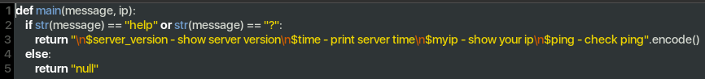
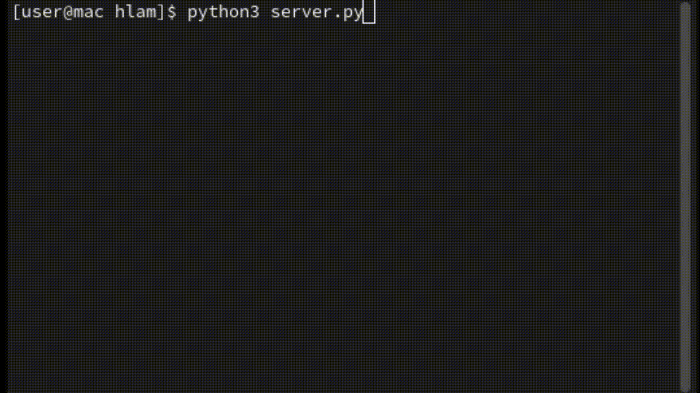

Nore-Core is CLIENT-SERVER core. the project was codded on Python, with fully MULTITHREAD client and server + custom module support + full hidden message crypt. To create your own module just create .py file in module path and write head (Main def with message and ip arguments. Add message checker and if message not equal return pass) EXAMPLE:

Core have test-example of messanger, based on box system (User getting any message in any time from any user and this is saving in his own file which can be readed only by owner | user init based on sha256 ip hashing)

Demo

Every command handling by modules or utils - unknow command, help command, disconnect client and so on

BitCoin DONATION ☕️: bc1q24sqqj6p6htuktap2vht2uzna9u7w3wlk8kfwk

Monero DONATION ☕️: 86FBJmZrMPcQvNQJ7fJ1Khg9Z1YMUBE2N6jzPiUbLtaKWQD1sTHbcB5JmCmxmNDkKXXQkic5pezv5hR6BLTvrSvvK7wA5LR